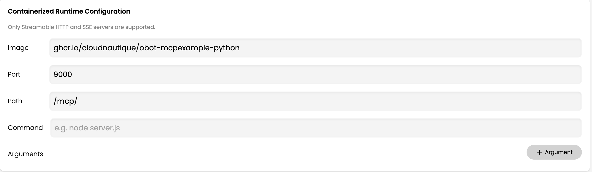

# MCP Add Numbers Server (Python)

A Model Context Protocol (MCP) server that provides a tool to add two numbers, built with FastMCP and Python.

## Features

- MCP tool: `add` - Adds two numbers together
- HTTP streamable transport
- Health check endpoint
- Configurable port via environment variable
- Docker support

## Installation

This project uses `uv` for package management:

```bash
uv sync
```

## Development

```bash
uv run main.py
```

## Configuration

- `PORT` environment variable (default: 9000)

## Endpoints

- `POST /mcp` - MCP endpoint for tool calls
- `GET /health` - Health check endpoint

## Docker

Build the image:

```bash
docker build -t python-mcp-server .
```

Run the container:

```bash
docker run -p 9000:9000 python-mcp-server
```

With custom port:

```bash
docker run -p 8080:8080 -e PORT=8080 python-mcp-server
```



## Usage Example

The server exposes an `add` tool that takes two numbers and returns their sum.

## Health Check

```bash
curl http://localhost:9000/health
```

Response:

```json
{
  "status": "ok"
}
```
